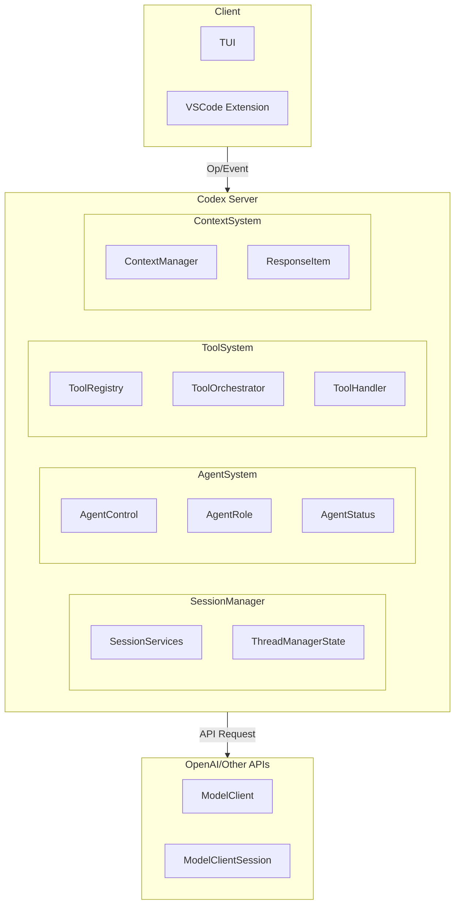

# Codex 项目深度代码分析

## 项目概述

Codex 是 OpenAI 开源的命令行编码代理工具，使用 Rust 编写。主要功能是在本地环境中协助开发者完成编程任务。项目采用客户端-服务器架构，前端使用 TUI (终端用户界面)，后端使用 Rust 宽现核心逻辑。

### 技术栈
- **语言**: Rust
- **异步运行时**: Tokio
- **序列化**: Serde / serde_json
- **协议**: 自定义 JSON-RPC 协议
- **UI**: Ratatui (TUI)

## 目录结构

```
codex/
├── codex-cli/          # CLI 入口和脚本
├── codex-rs/           # Rust 核心实现
│   ├── core/           # 核心业务逻辑
│   │   ├── agent/        # Agent 控制模块
│   │   ├── tools/        # 工具系统
│   │   ├── context_manager/ # 上下文管理
│   │   ├── state/        # 状态管理
│   │   └── ...
│   ├── protocol/       # 协议定义
│   ├── app-server/      # 应用服务器
│   └── ...
├── sdk/                # SDK
└── docs/               # 文档
```

## 核心架构图



## Agent 实现详解

### 核心类和接口

#### 1. AgentControl (agent/control.rs)

**位置**: `codex-rs/core/src/agent/control.rs`

**职责**: Agent 控制平面，负责多 Agent 操作的协调和管理

```rust
/// Control-plane handle for multi-agent operations.
/// `AgentControl` is held by each session (via `SessionServices`). It provides capability to
/// spawn new agents and the inter-agent communication layer.
/// An `AgentControl` instance is shared per "user session" which means the same `AgentControl`
/// is used for every sub-agent spawned by Codex. By doing so, we make sure the guards are
/// scoped to a user session.
#[derive(Clone, Default)]
pub(crate) struct AgentControl {
    /// Weak handle back to the global thread registry/state.
    manager: Weak<ThreadManagerState>,
    state: Arc<Guards>,
}
```

**关键方法**:

1. `spawn_agent()` - 生成新的 Agent
2. `spawn_agent_with_options()` - 带选项生成 Agent
3. `get_status()` - 获取 Agent 状态
4. `send_message()` - 向 Agent 发送消息

#### 2. AgentRole (agent/role.rs)

**位置**: `codex-rs/core/src/agent/role.rs`

**职责**: 定义和管理 Agent 角色

```rust
/// The role name used when a caller omits `agent_type`.
pub const DEFAULT_ROLE_NAME: &str = "default";

/// Applies a named role layer to `config` while preserving caller-owned model selection.
pub(crate) async fn apply_role_to_config(
    config: &mut Config,
    role_name: Option<&str>,
) -> Result<(), String>
```

**角色配置结构**:
- 内置角色 (default, reviewer, etc.)
- 用户自定义角色
- 角色配置层叠

#### 3. AgentStatus (agent/status.rs)

**位置**: `codex-rs/core/src/agent/status.rs`

```rust
#[derive(Clone, Copy, Debug, Default, Eq, PartialEq)]
pub enum AgentStatus {
    NotFound,
    Initializing,
    Idle,
    Running,
    Waiting,
    Completed,
    Failed,
}
```

### Agent 生命周期

```
sequenceDiagram
    participant User
    participant AgentControl
    participant ThreadManager
    participant Session

    User->>AgentControl: spawn_agent(config, items)
    AgentControl->>ThreadManager: reserve_spawn_slot()
    ThreadManager-->AgentControl: ThreadId
    AgentControl->>Session: create_session()
    Session->>AgentControl: SessionConfigured
    AgentControl->>User: ThreadId
    
    User->>AgentControl: send_message(thread_id, input)
    AgentControl->>Session: submit(input)
    Session->>AgentControl: Event
    AgentControl->>User: Event
```

### Agent 间通信机制

1. **消息传递**: 通过 `Op` 枚举定义的操作
2. **事件广播**: 通过 `Event` 枚举定义的事件
3. **状态同步**: 通过 `watch::Sender` 和 `watch::Receiver`

## 上下文管理详解

### 数据结构

#### ContextManager (context_manager/history.rs)

**位置**: `codex-rs/core/src/context_manager/history.rs`

```rust
/// Transcript of thread history
#[derive(Debug, Clone, Default)]
pub(crate) struct ContextManager {
    /// The oldest items are at the beginning of the vector.
    items: Vec<ResponseItem>,
    token_info: Option<TokenUsageInfo>,
    /// Reference context snapshot used for diffing
    reference_context_item: Option<TurnContextItem>,
}
```

**核心职责**:
- 管理对话历史记录
- 跟踪 Token 使用情况
- 提供历史记录规范化

### 上下文操作

#### 1. 记录项目

```rust
pub(crate) fn record_items<I>(&mut self, items: I, policy: TruncationPolicy)
where
    I: IntoIterator,
    I::Item: std::ops::Deref<Target = ResponseItem>,
{
    for item in items {
        let item_ref = item.deref();
        let is_ghost_snapshot = matches!(item_ref, ResponseItem::GhostSnapshot { .. });
        if !is_api_message(item_ref) && !is_ghost_snapshot {
            continue;
        }
        let processed = self.process_item(item_ref, policy);
        self.items.push(processed);
    }
}
```

#### 2. 获取用于 Prompt 的历史

```rust
pub(crate) fn for_prompt(mut self, input_modalities: &[InputModality]) -> Vec<ResponseItem> {
    self.normalize_history(input_modalities);
    self.items
        .retain(|item| !matches!(item, ResponseItem::GhostSnapshot { .. }));
    self.items
}
```

### 上下文压缩策略

#### Compact 系统 (compact.rs)

**位置**: `codex-rs/core/src/compact.rs`

**核心策略**:
1. **自动压缩**: 当上下文接近窗口限制时自动触发
2. **手动压缩**: 用户主动触发
3. **远程压缩**: 使用 OpenAI API 进行压缩

```rust
pub(crate) async fn run_inline_auto_compact_task(
    sess: Arc<Session>,
    turn_context: Arc<TurnContext>,
    initial_context_injection: InitialContextInjection,
) -> CodexResult<()> {
    let prompt = turn_context.compact_prompt().to_string();
    let input = vec![UserInput::Text {
        text: prompt,
        text_elements: Vec::new(),
    }];

    run_compact_task_inner(sess, turn_context, input, initial_context_injection).await?;
    Ok(())
}
```

**压缩流程**:
1. 收集用户消息
2. 调用模型生成摘要
3. 替换历史记录
4. 重新计算 Token 使用

## 消息处理流程

### 消息格式

#### Op 枚举 (protocol/protocol.rs)

```rust
#[derive(Debug, Clone, Deserialize, Serialize, PartialEq, JsonSchema)]
#[serde(tag = "type", rename_all = "snake_case")]
#[allow(clippy::large_enum_variant)]
#[non_exhaustive]
pub enum Op {
    Interrupt,
    CleanBackgroundTerminals,
    RealtimeConversationStart(ConversationStartParams),
    RealtimeConversationAudio(ConversationAudioParams),
    RealtimeConversationText(ConversationTextParams),
    RealtimeConversationClose,
    UserInput { items: Vec<UserInput>, final_output_json_schema: Option<Value> },
    UserTurn(UserTurnArgs),
    // ... more variants
}
```

#### EventMsg 枚举

```rust
#[derive(Debug, Clone, Deserialize, Serialize, PartialEq, JsonSchema, TS)]
#[serde(tag = "type", rename_all = "snake_case")]
pub enum EventMsg {
    SessionConfigured(SessionConfiguredEvent),
    TurnStarted(TurnStartedEvent),
    TurnAborted(TurnAbortedEvent),
    AgentMessage(AgentMessageEvent),
    AgentReasoning(AgentReasoningEvent),
    // ... more variants
}
```

### 消息序列化

- 使用 `serde_json` 进行 JSON 序列化
- 支持增量更新（Delta Events）
- 保持消息顺序

## 工具调用机制

### 工具定义

#### ToolSpec (tools/spec.rs)

```rust
#[derive(Debug, Clone, Serialize, Deserialize, PartialEq)]
#[serde(tag = "type", rename_all = "lowercase")]
pub enum JsonSchema {
    Boolean { description: Option<String> },
    String { description: Option<String> },
    Number { description: Option<String> },
    Array { items: Box<JsonSchema>, description: Option<String> },
    Object {
        properties: BTreeMap<String, JsonSchema>,
        required: Option<Vec<String>>,
        additional_properties: Option<AdditionalProperties>,
    },
}
```

### 工具注册

#### ToolRegistry (tools/registry.rs)

```rust
pub struct ToolRegistry {
    handlers: HashMap<String, Arc<dyn ToolHandler>>,
}

#[async_trait]
pub trait ToolHandler: Send + Sync {
    fn kind(&self) -> ToolKind;
    async fn is_mutating(&self, _invocation: &ToolInvocation) -> bool { false }
    async fn handle(&self, invocation: ToolInvocation) -> Result<ToolOutput, FunctionCallError>;
}
```

### 工具调用流程

```
sequenceDiagram
    participant Model
    participant ToolRegistry
    participant ToolOrchestrator
    participant ToolHandler
    participant Sandbox

    Model->>ToolRegistry: tool_call(name, arguments)
    ToolRegistry->>ToolOrchestrator: dispatch(invocation)
    ToolOrchestrator->>ToolOrchestrator: check_approval_policy
    alt Approval needed then
        ToolOrchestrator->>User: approval_request
        User->>ToolOrchestrator: decision
    end
    ToolOrchestrator->>Sandbox: select_sandbox
    ToolOrchestrator->>ToolHandler: run(req, sandbox)
    ToolHandler-->ToolOrchestrator: result
    ToolOrchestrator->>Model: tool_output
```

### 内置工具

1. **shell** - Shell 命令执行
2. **apply_patch** - 应用补丁
3. **spawn_agent** - 生成子 Agent
4. **read_file** - 读取文件
5. **search** - BM25 搜索
6. **view_image** - 查看图像

## 核心文件分析

### codex.rs (核心会话实现)

**位置**: `codex-rs/core/src/codex.rs`
**行数**: ~12000+ 行

**职责**: 核心会话实现，处理完整的 Agent 生命周期

**关键结构**:
```rust
pub struct Session {
    pub conversation_id: ThreadId,
    pub services: SessionServices,
    session_state: Mutex<SessionState>,
    active_turn: Mutex<Option<ActiveTurn>>,
}
```

**核心功能**:
- 会话初始化和配置
- Turn 执行管理
- 事件发送和接收
- 历史记录管理
- 工具调用协调

### agent/control.rs (Agent 控制)

**位置**: `codex-rs/core/src/agent/control.rs`
**行数**: ~1800+ 行

**职责**: Agent 控制平面，管理多 Agent 操作

**关键功能**:
```rust
pub(crate) async fn spawn_agent_with_options(
    &self,
    config: crate::config::Config,
    items: Vec<UserInput>,
    session_source: Option<SessionSource>,
    options: SpawnAgentOptions,
) -> CodexResult<ThreadId>
```

### tools/spec.rs (工具规范)

**位置**: `codex-rs/core/src/tools/spec.rs`
**行数**: ~3600+ 行

**职责**: 定义工具规范和 JSON Schema

**关键结构**:
- `ToolsConfig` - 工具配置
- `JsonSchema` - JSON Schema 定义
- 工具参数定义

### context_manager/history.rs (历史管理)

**位置**: `codex-rs/core/src/context_manager/history.rs`
**行数**: ~650+ 行

**职责**: 管理对话历史

**核心方法**:
- `record_items()` - 记录项目
- `for_prompt()` - 获取用于 prompt 的历史
- `normalize_history()` - 规范化历史

### compact.rs (上下文压缩)

**位置**: `codex-rs/core/src/compact.rs`
**行数**: ~1000+ 行

**职责**: 实现上下文压缩功能

**关键功能**:
- 自动压缩触发检测
- 压缩任务执行
- 历史摘要生成
- Token 使用重新计算

## 设计模式总结

### 1. Actor 模式
- 每个 Agent 是独立的 Actor
- 通过消息传递进行通信
- 状态隔离

### 2. 策略模式
- 不同的沙箱策略
- 不同的审批策略
- 可配置的工具行为

### 3. 观察者模式
- 事件广播机制
- 状态变化通知
- UI 更新

### 4. 工厂模式
- Agent 创建
- 工具实例化
- 沙箱选择

### 5. 注册表模式
- 工具注册
- 角色注册
- 处理器注册

## 关键代码片段

### 1. Agent 生成示例

```rust
// agent/control.rs: 100-150
pub(crate) async fn spawn_agent(
    &self,
    config: crate::config::Config,
    items: Vec<UserInput>,
    session_source: Option<SessionSource>,
) -> CodexResult<ThreadId> {
    let state = self.upgrade()?;
    let mut reservation = self.state.reserve_spawn_slot(config.agent_max_threads)?;
    
    // ... 创建新线程
    let new_thread = state
        .spawn_new_thread_with_source(
            config,
            self.clone(),
            session_source,
            false,
            None,
            inherited_shell_snapshot,
        )
        .await?;
    
    Ok(new_thread.conversation_id)
}
```

### 2. 工具调用示例

```rust
// tools/registry.rs: 100-150
pub async fn dispatch(
    &self,
    invocation: ToolInvocation,
) -> Result<ResponseInputItem, FunctionCallError> {
    let tool_name = invocation.tool_name.clone();
    
    let handler = match self.handler(tool_name.as_ref()) {
        Some(handler) => handler,
        None => {
            return Err(FunctionCallError::RespondToModel(
                unsupported_tool_call_message(&invocation.payload, tool_name.as_ref())
            ));
        }
    };
    
    // 执行工具
    handler.handle(invocation).await
}
```

### 3. 上下文压缩示例

```rust
// compact.rs: 100-150
pub(crate) async fn run_inline_auto_compact_task(
    sess: Arc<Session>,
    turn_context: Arc<TurnContext>,
    initial_context_injection: InitialContextInjection,
) -> CodexResult<()> {
    // 1. 准备压缩 prompt
    let prompt = turn_context.compact_prompt().to_string();
    let input = vec![UserInput::Text {
        text: prompt,
        text_elements: Vec::new(),
    }];
    
    // 2. 运行压缩任务
    run_compact_task_inner(sess, turn_context, input, initial_context_injection).await?;
    
    Ok(())
}
```

## 总结

Codex 是一个复杂而设计精良的 AI 编程助手系统，具有以下特点:

1. **模块化架构**: 清晰的模块划分，职责明确
2. **可扩展性**: 支持自定义工具、角色和配置
3. **安全性**: 実现了沙箱隔离和权限控制
4. **性能优化**: 上下文压缩、Token 管理等
5. **多 Agent 支持**: 原生支持多 Agent 协作

该项目展示了如何构建一个生产级别的 AI Agent 系统，值得深入学习和参考。
