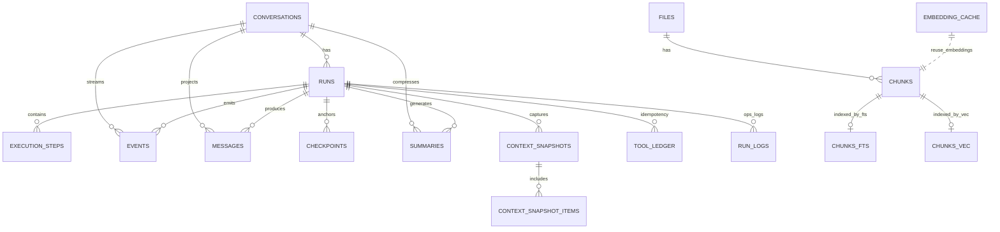
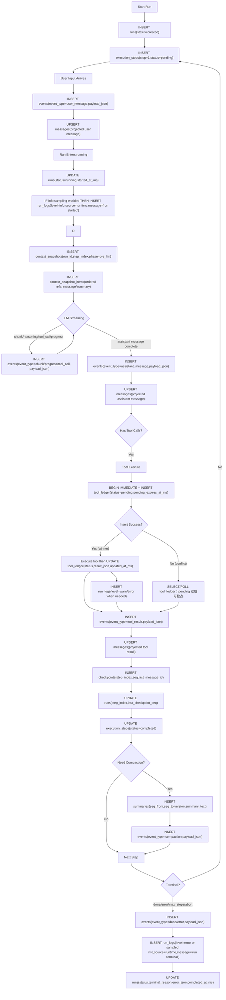

# 13. SQLite 设计（参考 OpenClaw）

> 本版按 OpenClaw 的真实数据库思路重构：  
> - **运行状态层**：偏事务与可回放（run/execution/event）  
> - **检索索引层**：偏搜索与召回（files/chunks/fts/vec/cache）

---

## 1. 参考基线（OpenClaw）

本设计直接参考以下 OpenClaw 结构与约定：

1. `src/memory/memory-schema.ts`  
   - `meta` / `files` / `chunks` / `embedding_cache` / `fts5`
2. `src/memory/manager-sync-ops.ts`  
   - `vec0` 向量表（`chunks_vec`）按需启用
3. `extensions/open-prose/skills/prose/state/sqlite.md`  
   - `run` / `execution` / `bindings` 的状态建模思想

核心结论：**不要把“运行状态”和“搜索索引”混在一张消息大表里**。

---

## 2. 总体分层

## 2.1 运行状态层（主库）

用于事务一致性、审计回放、执行恢复：

- `meta`
- `conversations`
- `runs`
- `execution_steps`
- `events`（append-only 真相源）
- `messages`（事件投影，便于读）
- `checkpoints`（恢复锚点，推荐）
- `summaries`
- `context_snapshots`
- `context_snapshot_items`
- `tool_ledger`
- `run_logs`（可选，运维技术日志）

## 2.2 检索索引层（可与主库同库或分库）

用于全文检索、语义检索、缓存复用：

- `files`
- `chunks`
- `embedding_cache`
- `chunks_fts`（FTS5 虚表，可选）
- `chunks_vec`（vec0 虚表，可选）

## 2.3 每个表的作用（职责总览）

| 表名 | 层级 | 作用 | 谁写入 | 谁读取 |
|---|---|---|---|---|
| `meta` | 运行/索引公共 | 保存 schema 版本、开关与索引元信息 | migration / indexer | 启动初始化、迁移器 |
| `conversations` | 运行状态 | 会话主记录（容器），承载会话级配置与状态 | orchestrator | 会话列表、run 创建逻辑 |
| `runs` | 运行状态 | 一次执行的生命周期记录（状态机、终止原因、错误） | orchestrator | run-status、恢复、审计 |
| `execution_steps` | 运行状态 | 运行内每个 step 的阶段状态与耗时 | orchestrator | 调试、性能分析 |
| `events` | 运行状态（真相源） | append-only 事件流，保留完整事实（含 chunk/progress） | orchestrator/agent bridge | 回放器、投影构建器、审计 |
| `messages` | 运行状态（投影） | 面向读取优化的消息视图（从 events 投影） | projector | 聊天渲染、上下文拼装 |
| `checkpoints` | 运行状态（恢复锚点） | 每步恢复点索引，快速恢复执行 | orchestrator | `resume`、恢复诊断 |
| `summaries` | 运行状态（派生） | 历史区间压缩摘要，降低上下文 token 成本 | compactor | 上下文选择器 |
| `context_snapshots` | 运行状态（派生） | 记录某步真正喂给模型的上下文快照头 | context builder | 排障、重放、可解释性分析 |
| `context_snapshot_items` | 运行状态（派生） | 快照条目明细（按顺序引用 message/summary） | context builder | prompt 重建器 |
| `tool_ledger` | 运行状态 | 工具调用幂等账本，避免副作用重复执行 | tool executor | tool executeOnce 去重逻辑 |
| `run_logs` | 运行状态（可选） | 技术日志流（warn/error 为主），用于运维排障 | orchestrator / runtime logger | 诊断面板、运维排障 |
| `files` | 检索索引 | 被索引文档的文件级登记 | indexer | 增量索引器、删除同步器 |
| `chunks` | 检索索引 | 文本分块主表（检索基础语料） | indexer | 搜索器、召回器 |
| `embedding_cache` | 检索索引 | embedding 结果缓存，减少重复向量计算 | embedder/indexer | 索引器、召回器 |
| `chunks_fts` | 检索索引（可选） | 关键词全文检索入口（FTS5） | indexer | keyword / hybrid search |
| `chunks_vec` | 检索索引（可选） | 向量近邻检索入口（vec0） | indexer | semantic / hybrid search |

说明：
- `events` 是唯一事实流水；`messages`/`summaries`/`context_*` 都是可重建派生层。
- 检索层表 (`files/chunks/fts/vec/cache`) 与运行状态表解耦，避免互相拖慢。

---

## 3. 字段设计（含含义与原因）

## 3.1 `meta`（作用：保存系统元信息与版本开关）

| 字段 | 类型 | 含义 | 为什么这么存 |
|---|---|---|---|
| `key` | TEXT PK | 配置/版本键 | 兼容迁移，避免硬编码 |
| `value` | TEXT NOT NULL | 值（字符串/JSON） | 轻量可扩展 |

用于记录：
- `schema_version`
- `fts_enabled`
- `vector_enabled`
- `index_meta_v1`（模型、chunk 参数等）

## 3.2 `conversations`（作用：会话主记录与会话级配置容器）

| 字段 | 类型 | 含义 | 为什么这么存 |
|---|---|---|---|
| `conversation_id` | TEXT PK | 会话 ID | 全局主键 |
| `title` | TEXT | 会话名 | 列表展示 |
| `channel` | TEXT NULL | 来源通道（cli/webhook） | 与 OpenClaw session source 对齐 |
| `workspace_path` | TEXT NULL | 工作目录 | 多项目隔离 |
| `status` | TEXT NOT NULL | `active/archived` | 软归档 |
| `metadata_json` | TEXT NULL | 扩展元数据 | 减少频繁改表 |
| `created_at_ms` | INTEGER | 创建时间 | 审计 |
| `updated_at_ms` | INTEGER | 更新时间 | 最近活跃排序 |

## 3.3 `runs`（作用：一次运行生命周期状态机）

| 字段 | 类型 | 含义 | 为什么这么存 |
|---|---|---|---|
| `run_id` | TEXT PK | 一次运行 ID | 对齐 `executionId` |
| `conversation_id` | TEXT FK | 所属会话 | 归属关系 |
| `status` | TEXT NOT NULL | `created/queued/running/completed/failed/cancelled` | 状态机（Phase 1 可不启用 queued） |
| `terminal_reason` | TEXT NULL | `stop/max_steps/error/timeout/...` | 终止语义清晰 |
| `max_steps` | INTEGER NULL | 步数预算 | 可回放 |
| `step_index` | INTEGER NOT NULL | 当前/最终步数 | 恢复定位 |
| `last_checkpoint_seq` | INTEGER NULL | 最近 checkpoint 的会话序号 | 快速恢复锚点 |
| `request_json` | TEXT NULL | 入参快照（systemPrompt/tools/config） | 完整复现 |
| `error_json` | TEXT NULL | 错误包（code/category/message/httpStatus） | 对齐错误契约 |
| `created_at_ms` | INTEGER | 创建时间 | 生命周期 |
| `started_at_ms` | INTEGER NULL | 启动时间 | 性能分析 |
| `completed_at_ms` | INTEGER NULL | 结束时间 | 终态追踪 |
| `updated_at_ms` | INTEGER | 更新时间 | 列表查询 |

> 参考 OpenClaw 的 `run + execution` 分层：run 是一次完整运行容器。

## 3.4 `execution_steps`（作用：记录 run 内每步阶段状态与耗时）

| 字段 | 类型 | 含义 | 为什么这么存 |
|---|---|---|---|
| `run_id` | TEXT FK | 所属 run | 父子关系 |
| `step_index` | INTEGER | 第几步 | 主定位键 |
| `status` | TEXT NOT NULL | `pending/executing/completed/failed/skipped` | 类似 OpenClaw `execution.status` |
| `stage` | TEXT NULL | `llm/tool/checkpoint` | 分阶段追踪 |
| `started_at_ms` | INTEGER NULL | 开始时间 | 统计 |
| `completed_at_ms` | INTEGER NULL | 结束时间 | 统计 |
| `error_json` | TEXT NULL | 步骤错误 | 精细排障 |
| `metadata_json` | TEXT NULL | 附加信息 | 保持弹性 |

主键建议：`PRIMARY KEY(run_id, step_index)`。

## 3.5 `events`（作用：append-only 事实事件流，系统真相源）

| 字段 | 类型 | 含义 | 为什么这么存 |
|---|---|---|---|
| `event_id` | INTEGER PK AUTOINCREMENT | 事件流水号 | 严格时序 |
| `conversation_id` | TEXT FK | 所属会话 | 会话回放 |
| `run_id` | TEXT FK NULL | 所属 run | 运行回放 |
| `seq` | INTEGER NOT NULL | 会话内序号 | 业务顺序稳定 |
| `event_type` | TEXT NOT NULL | `user_message/assistant_message/chunk/reasoning_chunk/tool_call/tool_result/tool_stream/progress/checkpoint/compaction/done/error/...` | 统一事件模型（含应用层派生事件） |
| `payload_json` | TEXT NOT NULL | 原始事件负载 | 兼容字段演进 |
| `created_at_ms` | INTEGER NOT NULL | 事件时间 | 审计 |

为什么要 `events`：
- 完整保留事实，不丢增量信息（chunk/progress）
- 任意时间可重建 `messages`、`snapshots` 等投影
- 与 OpenClaw transcript-first 思路一致

## 3.6 `messages`（作用：从事件投影出的消息读模型）

| 字段 | 类型 | 含义 | 为什么这么存 |
|---|---|---|---|
| `message_id` | TEXT PK | 消息 ID | 快速随机访问 |
| `conversation_id` | TEXT FK | 所属会话 | 主查询维度 |
| `run_id` | TEXT FK NULL | 来源 run | 定位执行 |
| `seq` | INTEGER NOT NULL | 顺序 | 与 events 对齐 |
| `step_index` | INTEGER NULL | 所属 step | 排障 |
| `role` | TEXT NOT NULL | `system/user/assistant/tool` | 兼容 provider |
| `type` | TEXT NOT NULL | `assistant-text/tool-call/tool-result/summary/...` | UI 与逻辑分流 |
| `content_json` | TEXT NOT NULL | 内容（文本/多模态） | 对齐 `Message.content` |
| `reasoning_content` | TEXT NULL | 思考流 | 对齐模型输出 |
| `tool_call_id` | TEXT NULL | 工具调用关联 | tool 配对 |
| `tool_calls_json` | TEXT NULL | assistant 工具调用数组 | 多工具场景 |
| `usage_json` | TEXT NULL | token 使用明细 | 保留原始形态 |
| `metadata_json` | TEXT NULL | 扩展字段 | 兼容 |
| `created_at_ms` | INTEGER NOT NULL | 创建时间 | 排序 |

> 规则：`messages` 来自事件投影，可重建；不作为唯一真相源。

## 3.7 `summaries`（作用：历史区间压缩摘要）

| 字段 | 类型 | 含义 | 为什么这么存 |
|---|---|---|---|
| `summary_id` | TEXT PK | 摘要 ID | 可引用 |
| `conversation_id` | TEXT FK | 所属会话 | 查询维度 |
| `run_id` | TEXT FK NULL | 生成 run | 来源追踪 |
| `seq_from` | INTEGER NOT NULL | 覆盖起点 | 区间定位 |
| `seq_to` | INTEGER NOT NULL | 覆盖终点 | 区间定位 |
| `version` | INTEGER NOT NULL | 摘要策略版本 | 升级不覆盖历史 |
| `model` | TEXT NULL | 生成模型 | 质量归因 |
| `summary_text` | TEXT NOT NULL | 摘要正文 | 上下文拼装 |
| `token_stats_json` | TEXT NULL | token 统计 | 成本分析 |
| `metadata_json` | TEXT NULL | 扩展字段 | 策略演进 |
| `created_at_ms` | INTEGER NOT NULL | 创建时间 | 排序 |

唯一约束：`UNIQUE(conversation_id, seq_from, seq_to, version)`。

## 3.8 `context_snapshots`（作用：记录某步真实喂给模型的上下文快照头）

| 字段 | 类型 | 含义 | 为什么这么存 |
|---|---|---|---|
| `snapshot_id` | TEXT PK | 快照 ID | 主键 |
| `run_id` | TEXT FK | 所属 run | 回放维度 |
| `step_index` | INTEGER NOT NULL | 所属 step | 一步一快照 |
| `phase` | TEXT NOT NULL | `pre_llm` 等 | 多阶段扩展 |
| `strategy` | TEXT NULL | 选择策略 | 可解释性 |
| `token_budget` | INTEGER NULL | 预算 | 裁剪依据 |
| `token_used` | INTEGER NULL | 实际使用 | 预算命中 |
| `metadata_json` | TEXT NULL | 扩展 | 演进 |
| `created_at_ms` | INTEGER NOT NULL | 时间 | 审计 |

## 3.9 `context_snapshot_items`（作用：记录快照内按顺序引用的 message/summary 条目）

| 字段 | 类型 | 含义 | 为什么这么存 |
|---|---|---|---|
| `snapshot_id` | TEXT FK | 所属快照 | 父键 |
| `ordinal` | INTEGER NOT NULL | 顺序 | 保证 prompt 顺序 |
| `source_type` | TEXT NOT NULL | `message/summary` | 来源类型 |
| `source_id` | TEXT NOT NULL | `message_id` 或 `summary_id` | 统一引用键 |
| `seq_from` | INTEGER NULL | 覆盖区间起点 | 快速过滤 |
| `seq_to` | INTEGER NULL | 覆盖区间终点 | 快速过滤 |
| `token_estimate` | INTEGER NULL | token 估算 | 解释裁剪 |
| `metadata_json` | TEXT NULL | 扩展信息 | 兼容 |

主键：`PRIMARY KEY(snapshot_id, ordinal)`。

## 3.10 `tool_ledger`（作用：工具调用幂等账本，防副作用重复执行）

| 字段 | 类型 | 含义 | 为什么这么存 |
|---|---|---|---|
| `run_id` | TEXT FK | 所属 run | 幂等范围 |
| `tool_call_id` | TEXT | 工具调用 ID | 幂等键 |
| `status` | TEXT NOT NULL | `pending/success/failed` | 支持并发占位与结果态 |
| `lease_owner` | TEXT NULL | 当前占位执行者 | 崩溃恢复与诊断 |
| `pending_expires_at_ms` | INTEGER NULL | pending 过期时间 | 防止永久 pending |
| `result_json` | TEXT NULL | 输出与错误信息 | `pending` 阶段可为空，完成后回放复用 |
| `attempt_count` | INTEGER NOT NULL | 执行尝试次数 | 排障与重试分析 |
| `recorded_at_ms` | INTEGER NOT NULL | 创建时间 | 审计 |
| `updated_at_ms` | INTEGER NOT NULL | 更新时间 | 过期判定与清理 |

主键：`PRIMARY KEY(run_id, tool_call_id)`。  
用途：与 `executeOnce` 语义对齐，防重放副作用。

推荐写入顺序：
1. 事务内 `INSERT ... status=pending, pending_expires_at_ms=now+ttl` 抢占执行权（主键冲突即并发命中）。  
2. 赢家执行副作用工具。  
3. 事务内 `UPDATE ... status=success/failed, result_json=..., updated_at_ms=now`。  
4. 竞争方读取已落账本结果；若命中过期 pending 可按租约规则抢占。  

## 3.11 `checkpoints`（作用：恢复锚点索引，降低 resume 成本）

| 字段 | 类型 | 含义 | 为什么这么存 |
|---|---|---|---|
| `run_id` | TEXT FK | 所属 run | 恢复定位 |
| `step_index` | INTEGER NOT NULL | 所属 step | 一步一断点 |
| `seq` | INTEGER NOT NULL | 对应事件序号 | 与 events 对齐 |
| `last_message_id` | TEXT NULL | 最近消息 ID | 快速恢复上下文 |
| `checkpoint_json` | TEXT NULL | 扩展载荷 | 兼容演进 |
| `created_at_ms` | INTEGER NOT NULL | 创建时间 | 审计 |

主键建议：`PRIMARY KEY(run_id, step_index)`。

## 3.12 `run_logs`（作用：记录运维技术日志，补充 events 之外的诊断信息，可选）

| 字段 | 类型 | 含义 | 为什么这么存 |
|---|---|---|---|
| `id` | INTEGER PK AUTOINCREMENT | 日志流水号 | 稳定时序与分页 |
| `run_id` | TEXT FK | 所属 run | 快速定位某次执行 |
| `step_index` | INTEGER NULL | 所属 step | 步骤级定位 |
| `level` | TEXT NOT NULL | `debug/info/warn/error` | 标准日志等级 |
| `code` | TEXT NULL | 机器可读错误/告警码 | 聚合分析与告警 |
| `source` | TEXT NULL | `agent/tool/runtime/store` | 日志来源分类 |
| `message` | TEXT NOT NULL | 日志正文 | 人类可读排障 |
| `context_json` | TEXT NULL | 上下文对象 | 保存结构化诊断细节 |
| `created_at_ms` | INTEGER NOT NULL | 记录时间 | 审计与排序 |

建议：
- 默认只落 `warn/error`，`info/debug` 通过开关采样，避免本地库膨胀。
- `run_logs` 不是业务真相源，不能替代 `events`。

---

## 4. 检索索引层（OpenClaw 同款）

## 4.1 `files`（作用：被索引文档的文件级登记）

| 字段 | 类型 | 含义 |
|---|---|---|
| `path` | TEXT PK | 文档路径（可虚拟路径） |
| `source` | TEXT NOT NULL | 来源（`memory/session/conversation`） |
| `hash` | TEXT NOT NULL | 文档哈希 |
| `mtime` | INTEGER NOT NULL | 修改时间 |
| `size` | INTEGER NOT NULL | 字节大小 |

## 4.2 `chunks`（作用：文本分块主表，检索语料核心）

| 字段 | 类型 | 含义 |
|---|---|---|
| `id` | TEXT PK | chunk ID |
| `path` | TEXT NOT NULL | 所属 file path |
| `source` | TEXT NOT NULL | 来源 |
| `start_line` | INTEGER NOT NULL | 起始行/段 |
| `end_line` | INTEGER NOT NULL | 结束行/段 |
| `hash` | TEXT NOT NULL | chunk 哈希 |
| `model` | TEXT NOT NULL | embedding 模型 |
| `text` | TEXT NOT NULL | chunk 文本 |
| `embedding` | TEXT NOT NULL | embedding(JSON) |
| `updated_at` | INTEGER NOT NULL | 更新时间 |

> 对会话可用“伪路径”映射：`conversation/{conversation_id}/seq-{from}-{to}`。

## 4.3 `embedding_cache`（作用：向量计算缓存，降低重复 embedding 成本）

| 字段 | 类型 | 含义 |
|---|---|---|
| `provider` | TEXT NOT NULL | 提供商 |
| `model` | TEXT NOT NULL | 模型 |
| `provider_key` | TEXT NOT NULL | 租户/账号维度键 |
| `hash` | TEXT NOT NULL | 文本哈希 |
| `embedding` | TEXT NOT NULL | 向量(JSON/BLOB) |
| `dims` | INTEGER NULL | 维度 |
| `updated_at` | INTEGER NOT NULL | 更新时间 |

主键：`PRIMARY KEY(provider, model, provider_key, hash)`。

## 4.4 `chunks_fts`（作用：关键词全文检索入口，可选）

FTS5 虚表字段建议：
- `text`
- `id UNINDEXED`
- `path UNINDEXED`
- `source UNINDEXED`
- `model UNINDEXED`
- `start_line UNINDEXED`
- `end_line UNINDEXED`

## 4.5 `chunks_vec`（作用：向量近邻检索入口，可选）

`vec0` 虚表示例：
- `id TEXT PRIMARY KEY`
- `embedding FLOAT[dim]`

---

## 5. 关键约束与索引

运行层：

1. `events`：`UNIQUE(conversation_id, seq)`  
2. `messages`：`UNIQUE(conversation_id, seq)`  
3. `execution_steps`：`PRIMARY KEY(run_id, step_index)`  
4. `checkpoints`：`PRIMARY KEY(run_id, step_index)`  
5. `context_snapshots`：`UNIQUE(run_id, step_index, phase)`  
6. `tool_ledger`：`PRIMARY KEY(run_id, tool_call_id)` + `INDEX(status, pending_expires_at_ms)`  
7. `runs`：`INDEX(conversation_id, updated_at_ms DESC)` + `INDEX(conversation_id, status, updated_at_ms DESC)`  
8. `events`：`INDEX(run_id, event_id)`  
9. `run_logs`：`INDEX(run_id, created_at_ms)` + `INDEX(level, created_at_ms)`

检索层：

1. `idx_chunks_path` on `chunks(path)`  
2. `idx_chunks_source` on `chunks(source)`  
3. `idx_embedding_cache_updated_at` on `embedding_cache(updated_at)`

SQLite pragma 建议：
- `PRAGMA journal_mode=WAL;`
- `PRAGMA synchronous=NORMAL;`
- `PRAGMA busy_timeout=5000;`
- `PRAGMA foreign_keys=ON;`

---

## 6. 为什么这版比“单消息大表”更稳

1. **真相源明确**：`events` append-only，任何投影坏了都能重建。  
2. **状态与检索解耦**：运行事务不被 FTS/向量索引拖慢。  
3. **向 OpenClaw 对齐**：索引层直接复用 `files/chunks/fts/cache/vec` 习惯。  
4. **可演进**：字段细节更多放 `*_json`，避免频繁迁移。  
5. **无状态友好**：进程重启后，run/context/ledger 都能从库恢复。  

---

## 7. 实施顺序（建议）

1. 先落运行层最小集：`meta/conversations/runs/events/messages/tool_ledger`  
2. 再补恢复与步骤层：`execution_steps/checkpoints`  
3. 再补上下文层：`summaries/context_snapshots/context_snapshot_items`  
4. 最后接检索层：`files/chunks/embedding_cache/chunks_fts/chunks_vec`
5. 可选加运维日志：`run_logs`（需要技术排障能力时启用）

这样可以先保证 CLI 可跑，再逐步增加压缩与检索能力。

---

## 8. Mermaid：表关系图（ER）



说明：
- 运行状态主链路是：`conversations -> runs -> execution_steps`。
- 真相源是 `events`；`messages` 是事件投影。
- 上下文构造链路是：`summaries + messages -> context_snapshots -> context_snapshot_items`。
- 检索链路与运行链路解耦：`files/chunks/fts/vec/cache`。

## 8.1 `events.seq` 原子分配规则（必须）

- 必须在单事务内完成“分配 seq + 插入 events”。
- 推荐模式：`BEGIN IMMEDIATE` + `INSERT ... SELECT COALESCE(MAX(seq),0)+1 ... WHERE conversation_id=?`。
- 依赖 `UNIQUE(conversation_id, seq)` 兜底；冲突时短重试。
- 禁止应用层先 `SELECT nextSeq` 再 `INSERT` 的两段式流程。

---

## 9. Mermaid：运行时“什么时候写什么表”



---

## 10. 触发点 -> 落表示例（速查）

| 触发点 | 必写表 | 可选写表 |
|---|---|---|
| 创建运行 | `runs` | `execution_steps` |
| 用户消息进入 | `events` | `messages` |
| 每次 LLM 调用前 | `context_snapshots`, `context_snapshot_items` | - |
| 流式 chunk/reasoning/tool_call/progress/tool_stream | `events` | - |
| assistant/tool 最终消息 | `events`, `messages` | `execution_steps` |
| 工具执行（防重） | `tool_ledger` | `events`, `messages` |
| step 断点落盘 | `checkpoints`, `runs` | `execution_steps` |
| 运行中的技术告警/错误 | `run_logs` | `events`（若需对外可见） |
| 触发压缩 | `summaries`, `events` | `context_snapshots*`（下一步重建时） |
| 运行终止 | `events`, `runs` | `execution_steps` |
| 建检索索引（异步） | `files`, `chunks` | `chunks_fts`, `chunks_vec`, `embedding_cache` |

---

## 11. `run_logs` 可执行 DDL 与使用建议

## 11.1 建表与索引（SQL）

```sql
CREATE TABLE IF NOT EXISTS run_logs (
  id INTEGER PRIMARY KEY AUTOINCREMENT,
  run_id TEXT NOT NULL,
  step_index INTEGER,
  level TEXT NOT NULL CHECK(level IN ('debug', 'info', 'warn', 'error')),
  code TEXT,
  source TEXT,
  message TEXT NOT NULL,
  context_json TEXT,
  created_at_ms INTEGER NOT NULL,
  FOREIGN KEY (run_id) REFERENCES runs(run_id) ON DELETE CASCADE
);

CREATE INDEX IF NOT EXISTS idx_run_logs_run_created
  ON run_logs(run_id, created_at_ms DESC);

CREATE INDEX IF NOT EXISTS idx_run_logs_level_created
  ON run_logs(level, created_at_ms DESC);

CREATE INDEX IF NOT EXISTS idx_run_logs_code_created
  ON run_logs(code, created_at_ms DESC);
```

## 11.2 写入策略（建议）

- 默认只写 `warn/error`。
- `info/debug` 通过配置开关采样写入（如 `runLogLevel=warn`）。
- `context_json` 仅放结构化诊断信息，避免把大文本重复写入（大文本仍走 `events/messages`）。

## 11.3 写入示例（SQL）

```sql
-- 运行开始（仅在开启 info 采样时）
INSERT INTO run_logs(run_id, step_index, level, code, source, message, context_json, created_at_ms)
VALUES (?, 0, 'info', 'RUN_STARTED', 'runtime', 'run started', ?, ?);

-- 工具失败（建议 warn/error）
INSERT INTO run_logs(run_id, step_index, level, code, source, message, context_json, created_at_ms)
VALUES (?, ?, 'error', 'TOOL_EXECUTION_FAILED', 'tool', 'tool execution failed', ?, ?);

-- 运行终止（done/error/max_steps/abort）
INSERT INTO run_logs(run_id, step_index, level, code, source, message, context_json, created_at_ms)
VALUES (?, ?, ?, 'RUN_TERMINAL', 'runtime', 'run terminal', ?, ?);
```

## 11.4 清理策略（SQL）

```sql
-- 按时间清理（例如仅保留 30 天）
DELETE FROM run_logs
WHERE created_at_ms < ?;

-- 可选：只清理低级别日志
DELETE FROM run_logs
WHERE level IN ('debug', 'info')
  AND created_at_ms < ?;
```

说明：
- `run_logs` 用于运维诊断，不替代 `events`。
- 若磁盘预算紧张，优先保留 `warn/error`，并对 `debug/info` 做短期保留。
