# 14. 项目流程图（Mermaid，详细版）

本文给出 CLI 应用层基于 `StatelessAgent` 的完整流程图，重点回答：

- 什么时候做什么
- 每一步写哪些表
- 终态如何收敛
- 异步索引何时触发

---

## 1. 端到端总流程（含命令分支）

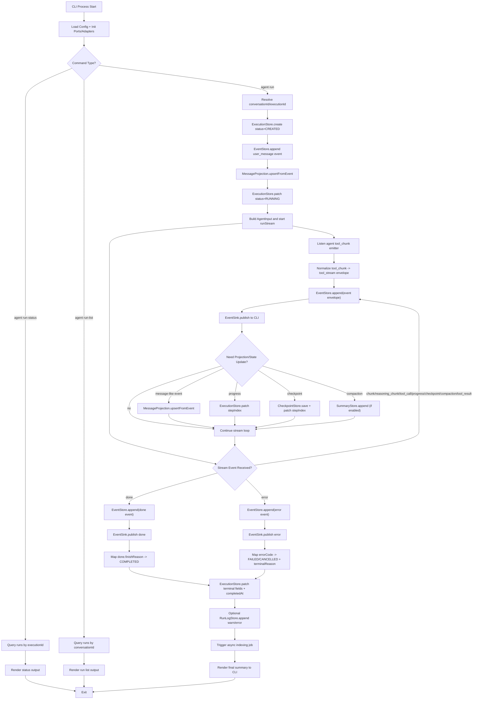

---

## 2. 运行时序图（谁在什么时候做什么）

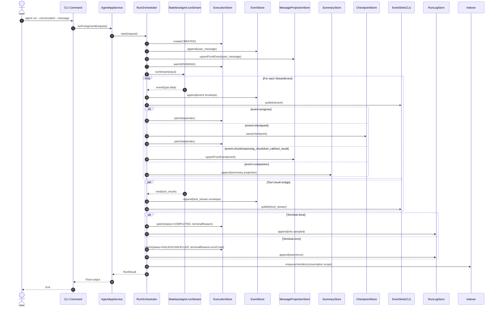

---

## 3. 执行状态机（终止语义）

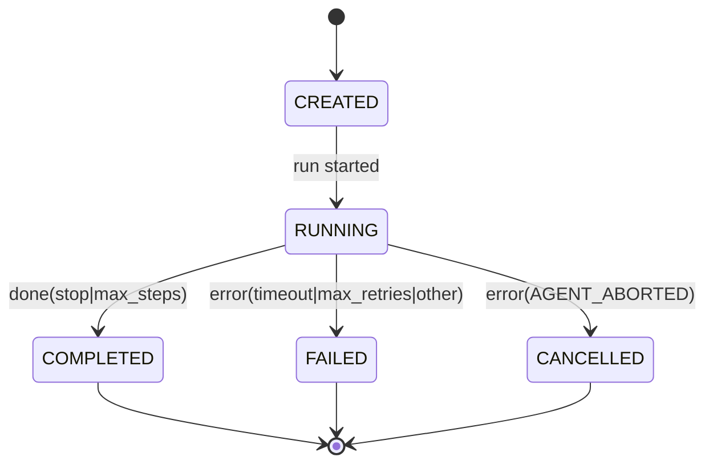

---

## 4. 触发点 -> 动作 -> 写表（详细）

| 阶段 | 触发点 | 动作 | 主要写表 |
|---|---|---|---|
| 初始化 | `agent run` 启动 | 建立运行记录 | `runs` |
| 输入入库 | 用户消息进入 | 写事实事件并更新投影 | `events`, `messages` |
| 进入运行 | runStream 开始 | 状态置为运行中 | `runs` |
| 流式过程 | 每个 stream event | 先写事件，再发布到 CLI | `events` |
| 工具流桥接 | `tool_chunk` emitter | 归一化为 `tool_stream` 并发布 | `events` |
| 过程同步 | `progress` | 更新 stepIndex | `runs` |
| 过程同步 | `checkpoint` | 保存断点与步数 | `checkpoints`, `runs` |
| 消息投影 | `chunk/reasoning/tool_*` | 更新消息读模型 | `messages` |
| 压缩阶段 | `compaction` | 事件已在统一入口落库，此处仅落摘要（若启用） | `summaries` |
| 工具幂等 | tool executeOnce | 防重放副作用 | `tool_ledger` |
| 错误诊断 | warn/error | 记录技术日志（可选） | `run_logs` |
| 终态收敛 | `done/error` | 写终态、终止原因、错误包 | `runs` |
| 后台索引 | run 结束后异步 | 更新检索索引 | `files`, `chunks`, `chunks_fts`, `chunks_vec`, `embedding_cache` |

---

## 5. 异步索引流程（run 结束后）

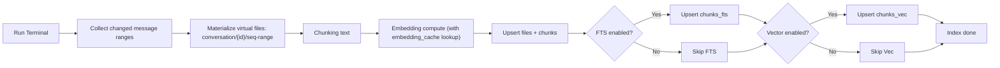

---

## 6. 落地顺序建议（与流程图一致）

1. 先实现运行主链路：`runs + events + messages + checkpoints`  
2. 再接入 `tool_ledger`（幂等）与 `run_logs`（可选）  
3. 最后实现异步索引链路：`files/chunks/fts/vec/cache`

---

## 7. 单次 `agent run` 详细时间线（何时写什么）

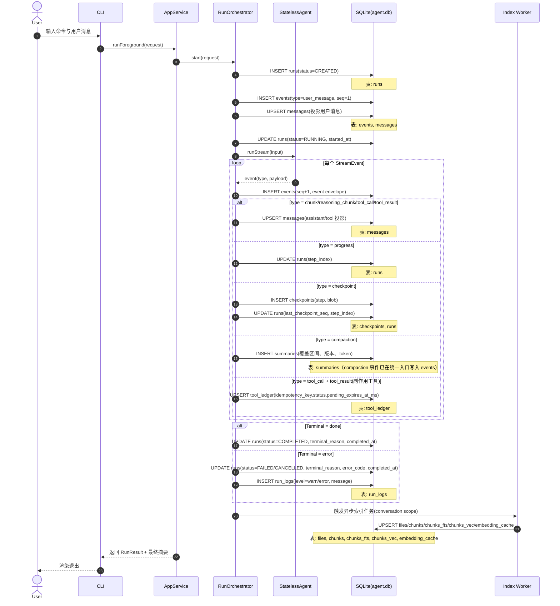

---

## 8. 失败重试与恢复执行（`agent resume`）

说明：
- **单次 run 内重试**由内核处理（`terminalReason=max_retries` 表示内核预算耗尽）。
- **跨 run 恢复**由 CLI 应用层处理（`agent resume` 创建新 `run_id`）。

### 8.1 恢复决策流程（何时恢复、何时冷启动）

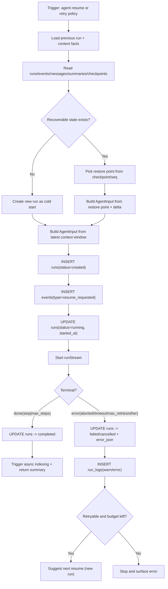

### 8.2 恢复执行时序（写表顺序）

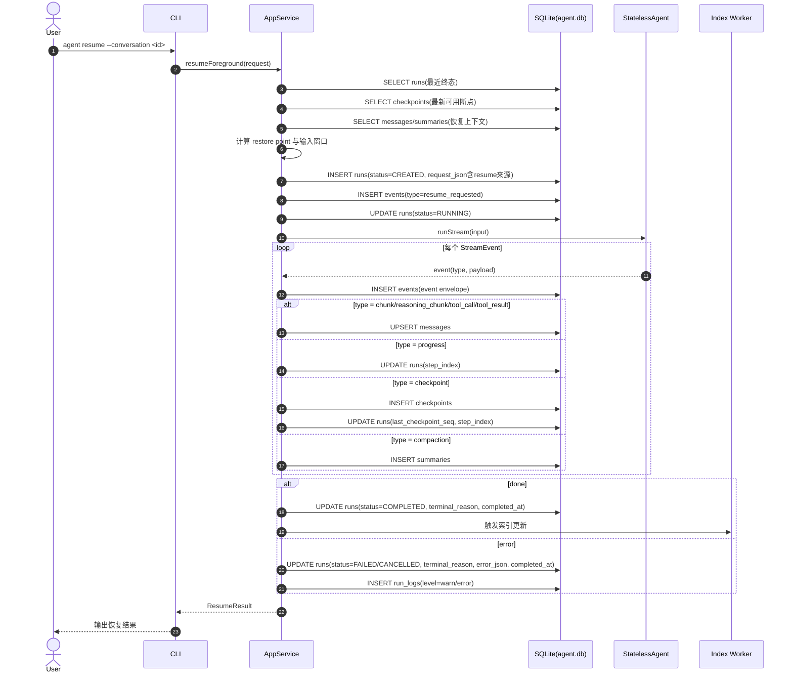

---

## 9. 并发冲突与幂等（`tool_ledger` 原子化）

目标：
- 同一 `run_id + tool_call_id` 在并发情况下只允许一次副作用执行。
- 其余并发请求返回已存在结果或等待执行完成。

### 9.1 `executeOnce` 原子流程（推荐实现）

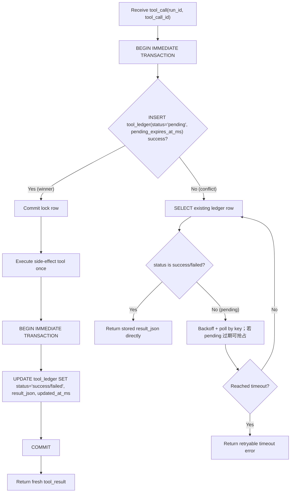

### 9.2 两个并发请求竞争同一工具调用

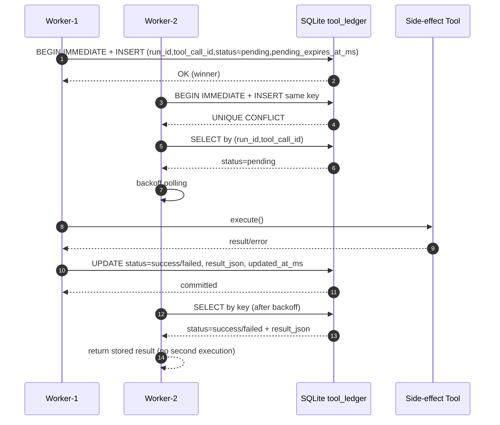

### 9.3 触发点 -> 动作 -> 写表（幂等专题）

| 场景 | 触发点 | 动作 | 写表 |
|---|---|---|---|
| 首次执行 | 未命中账本 | 插入 `pending + pending_expires_at_ms` 占位并成为执行者 | `tool_ledger` |
| 并发冲突 | 主键冲突 | 读取已有记录；若 `pending` 则轮询或按过期租约抢占 | `tool_ledger` |
| 执行成功 | 工具返回成功 | 更新状态为 `success` 并落结果 | `tool_ledger` |
| 执行失败 | 工具返回失败 | 更新状态为 `failed` 并落错误包 | `tool_ledger` |
| 读取复用 | 命中 `success/failed` | 直接返回已有 `result_json` | 仅读取 |
| 轮询超时 | 长时间 `pending` | 返回可重试错误并记日志 | `run_logs`（可选） |

### 9.4 与主流程的拼接点

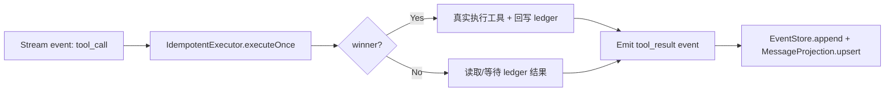

---

## 10. 终态分流与 CLI 输出策略

### 10.1 终态分流（`done/error` -> 状态/退出码/展示）

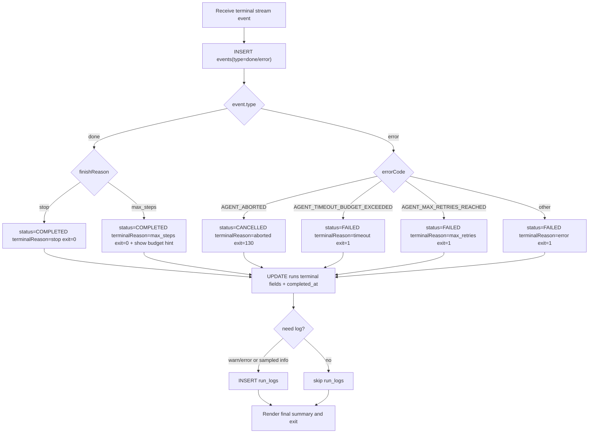

### 10.2 用户中断（SIGINT）路径

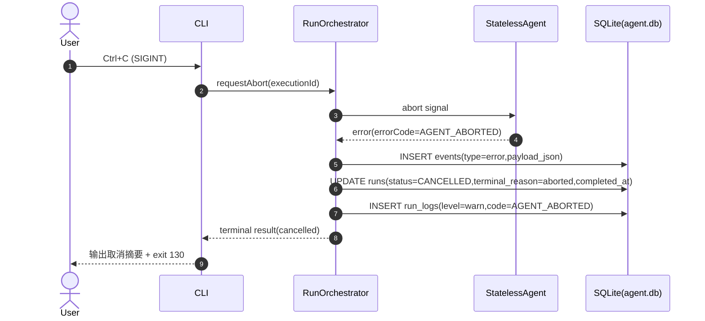

### 10.3 终态输出矩阵（速查）

| 终态来源 | status | terminalReason | CLI 退出码 | 用户可见提示 |
|---|---|---|---|---|
| `done.stop` | `COMPLETED` | `stop` | `0` | 正常完成 |
| `done.max_steps` | `COMPLETED` | `max_steps` | `0` | 达到步数上限（建议 `resume`） |
| `error.AGENT_ABORTED` | `CANCELLED` | `aborted` | `130` | 用户中断或上层取消 |
| `error.AGENT_TIMEOUT_BUDGET_EXCEEDED` | `FAILED` | `timeout` | `1` | 预算超时（可重试） |
| `error.AGENT_MAX_RETRIES_REACHED` | `FAILED` | `max_retries` | `1` | 达到重试上限（建议检查工具/网络） |
| `error.*` | `FAILED` | `error` | `1` | 未分类失败（查看 `errorCode`） |

---

## 11. 查询命令流程（`run-status` / `run-list`）

说明：
- 两个命令是**只读路径**，不写 `events/messages/runs`。
- 默认直接查投影表（`runs`），`--verbose` 再补查 `execution_steps/events`。

### 11.1 `agent run-status --execution <id>`

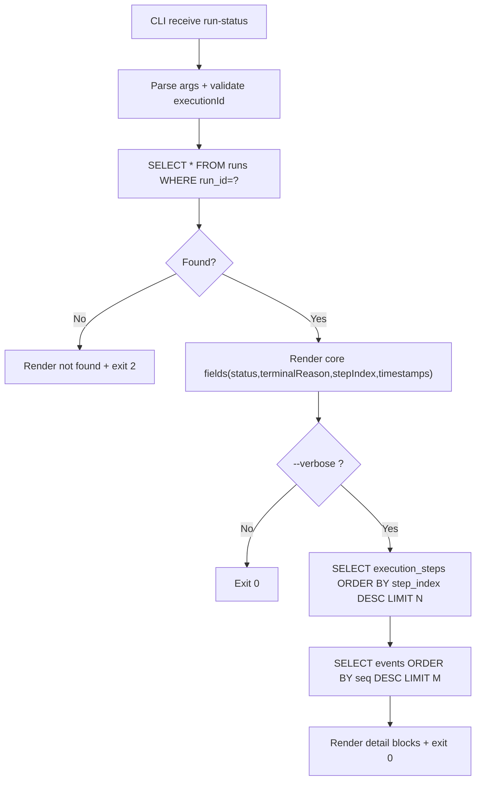

### 11.2 `agent run-status --watch` 轮询路径

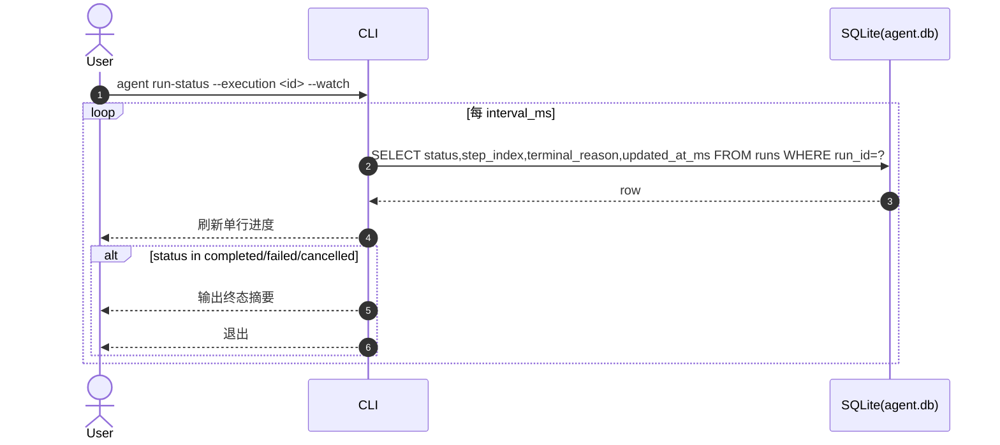

### 11.3 `agent run-list --conversation <id>`

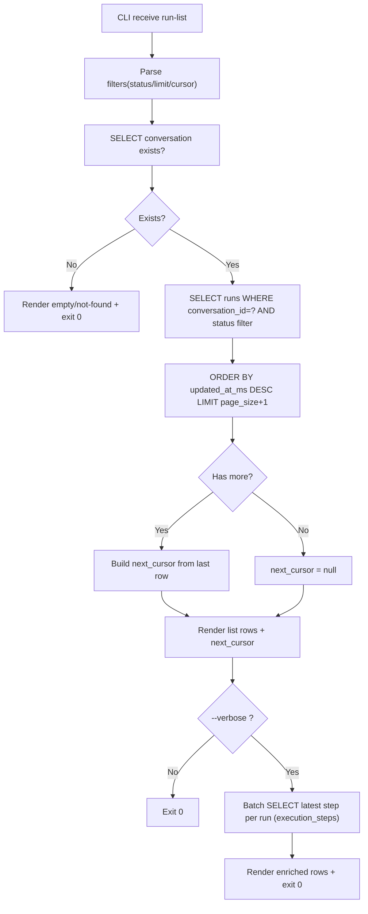

### 11.4 查询命令读表矩阵（速查）

| 命令 | 默认读取表 | `--verbose` 补充读取 | 写表 |
|---|---|---|---|
| `run-status` | `runs` | `execution_steps`, `events` | 无 |
| `run-status --watch` | `runs`（轮询） | - | 无 |
| `run-list` | `conversations`, `runs` | `execution_steps`（批量） | 无 |
