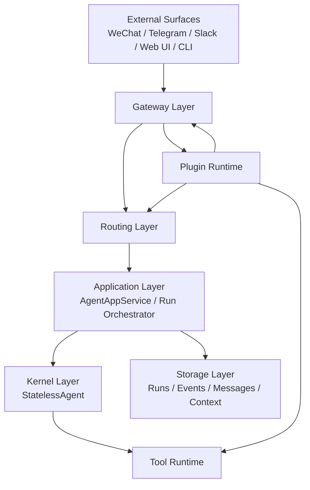
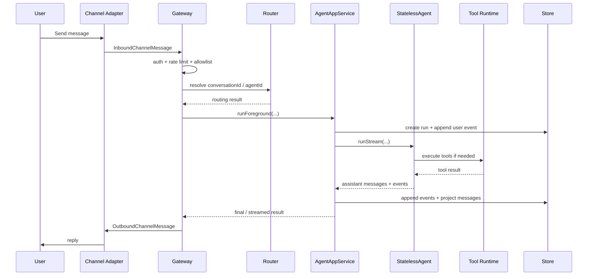

# 15. 基于 agent-v4 实现 OpenClaw 风格项目的完整蓝图

## 1. 这篇文档要解决什么问题

你现在有一个做得不错的无状态 Agent 内核，在目录 `src/agent-v4`。

你想要的不是“再写一个能回答问题的 Agent”，而是做一个更完整的系统：

- 能接入微信、Telegram、企业微信、Slack 等外部应用
- 能把外部消息路由到不同会话和不同 Agent
- 能通过 WebSocket / HTTP / Webhook 对外提供统一入口
- 能通过插件扩展渠道、命令、工具、服务
- 能长期运行、可观察、可排障、可部署

这正是 `openclaw` 的核心价值。

一句话总结：

> `agent-v4` 现在更像是“执行内核”，而 `openclaw` 是“执行内核 + 网关 + 渠道平台 + 插件系统 + 会话路由 + 运维安全”。

所以你应该做的，不是推翻 `agent-v4`，而是在它外面补齐平台层。

## 2. 先说结论：你现在已经有什么

从现有代码看，`agent-v4` 已经具备成为平台底座的几个关键条件。

### 2.1 无状态执行内核

`StatelessAgent` 已经是一个比较清晰的执行内核：

- 输入是 `messages + tools + config`
- 输出是流式事件
- 支持工具调用
- 支持工具幂等账本
- 支持超时预算
- 支持上下文压缩
- 不直接依赖具体渠道

这部分在：

- `src/agent-v4/agent/index.ts`

这意味着它适合作为系统最内层的 `Kernel`。

### 2.2 应用层编排

`AgentAppService` 已经在做比内核更上一层的事情：

- 创建 execution
- 追加事件
- 写消息投影
- 推送前台回调
- 汇总 usage
- 管理 run 状态

这部分在：

- `src/agent-v4/app/agent-app-service.ts`

这说明你已经有了“运行编排器”的雏形。

### 2.3 存储抽象和 SQLite 落地

你已经把存储拆成 Port：

- `ExecutionStorePort`
- `EventStorePort`
- `MessageProjectionStorePort`
- `ContextProjectionStorePort`
- `RunLogStorePort`

这部分在：

- `src/agent-v4/app/ports.ts`
- `src/agent-v4/app/sqlite-agent-app-store.ts`

这非常重要。因为 `openclaw` 风格项目本质上是事件驱动和多入口系统，没有 Port 抽象，后面会很难扩展。

### 2.4 工具系统

你已经有：

- 工具注册
- 工具参数校验
- 工具策略检查
- 工具确认流
- 工具并发策略

这部分在：

- `src/agent-v4/tool/tool-manager.ts`

这意味着你已经有一个很像 `openclaw` Tool Runtime 的基础版本。

### 2.5 子代理 / 工作流雏形

`task-subagent-config.ts` 说明你已经开始走“多角色、多工作模式”的方向：

- Explore
- Plan
- research-agent
- general-purpose

这会成为将来多 Agent 路由的重要基础。

## 3. 你缺什么

如果要做成 `openclaw` 那种项目，现在还缺五大块：

1. `Gateway`
2. `Channel Adapter`
3. `Plugin Runtime`
4. `Session Routing`
5. `Security + Ops`

下面逐个讲。

## 4. 正确的整体架构

建议你把项目理解成下面这 7 层。



### 4.1 每层职责

#### Surface Layer

这是用户和系统接触的入口：

- 微信
- Telegram
- Slack
- WebChat
- CLI
- 内部 HTTP API

这些入口不应该直接调用 `StatelessAgent`。

它们只能调用 `Gateway`。

#### Gateway Layer

这是整个系统的控制平面。

负责：

- 接受外部消息
- 鉴权
- 限流
- 识别入口类型
- 调用 Routing
- 启动一次 Agent 执行
- 把结果回发给渠道或前端

`openclaw` 最像的部分就在这里。

#### Routing Layer

负责把“某个渠道来的某条消息”映射到：

- 哪个 `conversationId`
- 哪个 `agentId`
- 哪个 `workspace`
- 哪个 `accountId`
- 哪个 `threadId`

这是多渠道系统最容易一开始忽略、后面最难补的东西。

#### Application Layer

这一层负责：

- 读上下文
- 组装执行输入
- 调用 `StatelessAgent`
- 把事件和消息写到数据库
- 产生运行状态

你现在的 `AgentAppService` 已经基本属于这一层。

#### Kernel Layer

只做一件事：

> 给我消息和工具，我来推理、决定是否调用工具、产出消息和事件。

这就是 `StatelessAgent`。

#### Tool Runtime

负责：

- 工具注册
- 工具权限
- 工具确认
- 工具执行
- 工具幂等
- 工具输出流

#### Storage Layer

负责：

- runs
- events
- messages
- context_messages
- run_logs
- routing bindings
- channel accounts
- pairing / allowlist

## 5. 你应该如何映射现有 agent-v4

下面是“现有代码 -> 目标系统角色”的映射表。

| 现有模块 | 角色 | 保留还是重写 |
| --- | --- | --- |
| `agent/index.ts` | Kernel | 保留 |
| `app/agent-app-service.ts` | Application Orchestrator | 保留并扩展 |
| `app/ports.ts` | App Ports | 保留 |
| `app/sqlite-agent-app-store.ts` | 本地存储适配器 | 保留并扩展 |
| `tool/tool-manager.ts` | Tool Runtime | 保留并扩展 |
| `tool/task-*` | 子任务 / 子代理能力 | 保留 |
| `docs/cli-app-layer/*` | 现有应用层文档 | 保留 |
| 新增 `gateway/*` | Gateway 控制平面 | 新增 |
| 新增 `channels/*` | 外部渠道适配器 | 新增 |
| 新增 `plugins/*` | 插件系统 | 新增 |
| 新增 `routing/*` | 会话路由 | 新增 |
| 新增 `security/*` | 安全和策略 | 新增 |

## 6. 推荐目录结构

建议在 `src/agent-v4` 下面逐步长成下面这样：

```text
src/agent-v4/
  agent/                # 无状态内核，保留
  app/                  # 执行编排，保留并扩展
  tool/                 # 工具系统，保留并扩展
  gateway/              # 新增：HTTP/WS/Webhook 控制平面
  channels/             # 新增：各平台接入
    base/
    webchat/
    telegram/
    wechat/
    slack/
  plugins/              # 新增：插件加载与注册
  routing/              # 新增：conversation / agent / account 路由
  security/             # 新增：auth、allowlist、pairing、rate limit
  surfaces/             # 可选：CLI / web / bot 入站聚合
  docs/
```

对于一个刚开始做后端的人，我建议你先不要追求一步到位。

先从最小结构开始：

```text
src/agent-v4/
  agent/
  app/
  tool/
  gateway/
  channels/
  routing/
  security/
```

等跑通以后，再补 `plugins/`。

## 7. 最核心的新概念：Gateway

如果说 `StatelessAgent` 是大脑，那 `Gateway` 就是神经中枢。

### 7.1 Gateway 负责什么

- 提供 HTTP API
- 提供 WebSocket 或 SSE 实时事件
- 接受外部 webhook
- 管理渠道适配器的生命周期
- 管理插件加载
- 管理运行时鉴权
- 调用 `AgentAppService`
- 把执行结果回送给渠道

### 7.2 一个最小 Gateway 需要哪些接口

建议先设计成下面这样：

```ts
export interface GatewayServer {
  start(): Promise<void>;
  stop(): Promise<void>;
}

export interface GatewayDeps {
  appService: AgentAppService;
  router: ConversationRouter;
  channelRegistry: ChannelRegistry;
  auth: GatewayAuthService;
  rateLimit: RateLimitService;
}
```

### 7.3 最小 HTTP API

第一阶段只做这些接口就够了：

- `POST /api/runs`
  触发一次会话执行
- `GET /api/runs/:executionId`
  查询一次执行状态
- `GET /api/conversations/:conversationId/messages`
  查看会话消息
- `GET /api/conversations/:conversationId/events`
  查看会话事件流
- `POST /api/webhooks/:channelId`
  接收入站渠道消息

### 7.4 实时能力

建议先做 SSE，再做 WebSocket。

原因：

- SSE 更简单
- 服务端推送 run 事件足够用了
- 适合你现在这种“后端初学 + Node.js”阶段

等你把系统跑稳了，再考虑 WS。

## 8. 最核心的新概念：Channel Adapter

这部分决定了你将来怎么接微信、Telegram、企业微信。

### 8.1 一个渠道适配器到底是什么

它不是 Agent。

它只是把外部平台消息翻译成统一格式，再把结果翻译回平台格式。

它应该只关心：

- 怎么收消息
- 怎么发消息
- 怎么登录 / 配对
- 怎么健康检查

### 8.2 建议统一的入站消息格式

```ts
export interface InboundChannelMessage {
  channelId: string;
  accountId?: string;
  peerId: string;
  threadId?: string;
  senderId: string;
  senderName?: string;
  text?: string;
  media?: Array<{
    type: 'image' | 'audio' | 'video' | 'file';
    url?: string;
    mimeType?: string;
    name?: string;
  }>;
  rawEvent?: unknown;
  receivedAt: number;
}
```

### 8.3 建议统一的出站消息格式

```ts
export interface OutboundChannelMessage {
  conversationId: string;
  channelId: string;
  accountId?: string;
  peerId: string;
  threadId?: string;
  text: string;
  replyToMessageId?: string;
}
```

### 8.4 建议的渠道接口

```ts
export interface ChannelAdapter {
  id: string;
  start(ctx: ChannelRuntimeContext): Promise<void>;
  stop(): Promise<void>;
  send(message: OutboundChannelMessage): Promise<ChannelSendResult>;
  probe?(): Promise<ChannelProbeResult>;
}
```

### 8.5 为什么微信不能写死在内核里

因为微信只是一个渠道。

今天你接微信：

- 可能是 webhook
- 可能是第三方协议
- 可能是桌面自动化

明天你接 Telegram：

- 可能是 webhook
- 可能是 bot API

这些都不应该污染 `StatelessAgent`。

正确做法是：

- `StatelessAgent` 不知道微信是什么
- `AgentAppService` 不知道微信 API 怎么调
- 只有 `channels/wechat/*` 知道微信怎么接

## 9. 最核心的新概念：Session Routing

这部分是 `openclaw` 风格系统里最值钱也最容易做错的设计。

### 9.1 为什么一定要有 Routing

因为一个真实系统里，消息不是只有“用户输入一句话”这么简单。

同一个人可能：

- 通过微信找你
- 通过 Telegram 找你
- 在群里艾特你
- 在不同账号下找你
- 在同一个平台的不同会话线程找你

你必须回答这几个问题：

- 这些消息是不是同一个 `conversationId`
- 是不是同一个 `agentId`
- 需不需要共享上下文
- 需不需要按群聊和私聊隔离

### 9.2 第一个版本的路由规则

刚开始不要太复杂，先用下面这套规则：

#### 私聊

```text
conversationId = dm:<channelId>:<accountId>:<peerId>
```

#### 群聊

```text
conversationId = group:<channelId>:<accountId>:<threadId or peerId>
```

#### 指定 Agent

如果渠道配置里指定了 `agentId`，那就把消息路由给该 Agent。

如果没指定，就走默认 Agent。

### 9.3 将来再升级的路由规则

以后你可以支持：

- 同一渠道不同账号路由到不同 Agent
- 同一群不同关键词路由到不同 Agent
- 同一个人跨渠道共享“用户画像”但不共享对话上下文

但这些都应该建立在“第一版规则稳定”之后。

## 10. Plugin Runtime 应该怎么做

`openclaw` 很强的一点，是它不是把所有能力写死在主程序里。

### 10.1 插件系统的目标

让外部模块可以注册：

- 渠道
- HTTP 路由
- 命令
- 后台服务
- Hook

### 10.2 你应该先做最小插件 API

```ts
export interface GatewayPluginApi {
  registerChannel(adapter: ChannelAdapter): void;
  registerHttpRoute(route: HttpRoute): void;
  registerCommand(command: GatewayCommand): void;
  registerService(service: BackgroundService): void;
}

export interface GatewayPlugin {
  id: string;
  name: string;
  register(api: GatewayPluginApi): void | Promise<void>;
}
```

### 10.3 为什么先不要一开始做太复杂

因为你是 Node.js 后端刚起步，插件系统一复杂，很容易一上来就陷入：

- manifest 设计过度
- sandbox 设计过度
- 动态 import 兼容性
- 生命周期混乱

所以建议三步走：

1. 先支持“本地代码插件”
2. 再支持“配置声明插件”
3. 最后再支持“包安装插件”

## 11. Security 需要从第一天就开始做

很多人一开始做 Agent 平台，只写功能，不写安全边界。

这会导致系统能跑，但不能上线。

### 11.1 第一版必须有的安全能力

- webhook secret
- basic token auth
- sender allowlist
- pairing code
- rate limit
- 工具权限控制

### 11.2 pairing 是什么

例如微信、Telegram、Slack 来了一个陌生人私信：

- 不是直接让 Agent 执行
- 先返回一个配对码
- 你在后台或 CLI 确认后，这个 sender 才进入 allowlist

这能大幅降低“公开入口直接被陌生人调用”的风险。

### 11.3 工具权限不要交给 LLM 自己决定

LLM 可以建议调用工具。

但是否允许执行，必须由系统策略层判断。

你现在的 `tool-manager.ts` 已经有这个方向，这是对的。

建议后面继续扩展成：

- `guest`
- `paired_user`
- `owner`
- `admin`

不同身份可以调用不同工具。

## 12. 存储层下一步应该扩什么

你现有的表已经很好了，但要做成 `openclaw` 风格项目，还需要补几类表。

### 12.1 conversations

记录会话元数据：

- `conversation_id`
- `channel_id`
- `account_id`
- `peer_id`
- `thread_id`
- `agent_id`
- `workspace_path`
- `status`

### 12.2 channel_accounts

记录渠道账号：

- `channel_id`
- `account_id`
- `display_name`
- `auth_state`
- `config_json`
- `enabled`

### 12.3 channel_pairings

记录陌生 sender 的配对状态：

- `channel_id`
- `account_id`
- `sender_id`
- `pair_code`
- `status`
- `expires_at`

### 12.4 sender_allowlist

记录允许访问的发送方：

- `channel_id`
- `account_id`
- `sender_id`
- `source`
- `created_at`

### 12.5 route_bindings

记录“某类消息应该路由给谁”：

- `channel_id`
- `account_id`
- `peer_id` 或 `thread_id`
- `agent_id`
- `conversation_id`

## 13. 推荐的第一版执行流程

下面是一个真实的“渠道消息 -> Agent 执行 -> 渠道回复”的流程。



## 14. 对一个后端初学者来说，真正应该先写什么

这部分最重要。

不要一上来就写“微信插件”。

你应该按下面的顺序推进。

### Phase A：把 Gateway 跑起来

目标：

- 一个 HTTP 服务能启动
- 能调用 `AgentAppService`
- 能保存 runs/events/messages

你要做的事：

1. 新建 `gateway/http-server.ts`
2. 暴露 `POST /api/runs`
3. 暴露 `GET /api/runs/:id`
4. 暴露 `GET /api/conversations/:id/messages`

验收标准：

- 通过 HTTP 发一句话
- 能收到结果
- 数据库里能看到 run 和 event

### Phase B：把 WebChat 做出来

目标：

- 先有一个最简单的 Web UI 或 Postman 流程
- 让你能稳定调试整个系统

为什么先做这个：

- 它最简单
- 不涉及第三方平台认证
- 可以快速验证 Gateway 和 Routing 设计对不对

### Phase C：加入 Routing

目标：

- 相同 conversation 能自动带上下文
- 不同 conversation 相互隔离

你要做的事：

1. 建 `conversations` 表
2. 实现 `ConversationRouter`
3. 实现 `ContextProviderPort.load()`

### Phase D：接入第一个真实渠道

建议优先选：

- Telegram Bot
- 企业微信 webhook
- 自建 WebChat

不要先选微信个人号，原因是：

- 接入方式不稳定
- 依赖第三方协议或桌面自动化
- 排障成本高

### Phase E：做插件系统

等你已经有：

- Gateway
- 一个渠道
- 稳定路由

再做插件系统。

因为这时你已经知道：

- 插件要注册什么
- 生命周期长什么样
- 哪些接口真的需要抽象

## 15. 微信在这个系统里应该放哪

微信不是核心层，不是应用层，也不是内核层。

它应该只属于：

- `channels/wechat/*`
或
- `plugins/wechat/*`

### 15.1 微信适配器应该负责什么

- 登录 / 绑定
- 收取入站消息
- 把微信事件转换成 `InboundChannelMessage`
- 把系统消息转换成微信发送接口调用

### 15.2 微信适配器不应该负责什么

- 不负责拼上下文
- 不负责决定 conversationId
- 不负责做 Agent 执行
- 不负责消息持久化
- 不负责业务权限判定

这几点必须严格分开。

## 16. 你应该写的第一批 TypeScript 接口

如果你现在开始实现，我建议先落这几组接口。

### 16.1 Gateway

```ts
export interface GatewayRequestContext {
  requestId: string;
  source: 'http' | 'webhook' | 'cli' | 'websocket';
  ip?: string;
  headers?: Record<string, string>;
}

export interface Gateway {
  handleInboundMessage(
    message: InboundChannelMessage,
    ctx: GatewayRequestContext
  ): Promise<void>;
}
```

### 16.2 Routing

```ts
export interface RoutingResult {
  conversationId: string;
  agentId: string;
  workspacePath?: string;
}

export interface ConversationRouter {
  resolveInbound(message: InboundChannelMessage): Promise<RoutingResult>;
}
```

### 16.3 Channel Registry

```ts
export interface ChannelRegistry {
  register(adapter: ChannelAdapter): void;
  get(channelId: string): ChannelAdapter | undefined;
  list(): ChannelAdapter[];
}
```

### 16.4 Plugin Registry

```ts
export interface PluginRegistry {
  loadAll(): Promise<void>;
  list(): GatewayPlugin[];
}
```

### 16.5 Security

```ts
export interface SenderAccessDecision {
  allowed: boolean;
  reason?: string;
  requiresPairing?: boolean;
}

export interface SenderAccessService {
  check(message: InboundChannelMessage): Promise<SenderAccessDecision>;
}
```

## 17. 最推荐的最小开发路线

对于你当前阶段，我最推荐下面这条路线：

1. 保持 `StatelessAgent` 不动
2. 保持 `AgentAppService` 为应用编排核心
3. 新增一个最小 `gateway/`
4. 新增一个最小 `routing/`
5. 新增一个最小 `channels/webchat/`
6. 跑通一条完整链路
7. 再接 Telegram
8. 最后再考虑微信

这是最稳的路径。

## 18. 容易踩的坑

### 坑 1：把渠道逻辑写进 Agent

后果：

- 以后每接一个平台都要改内核
- 测试难
- Bug 很难隔离

正确做法：

- 渠道只做适配

### 坑 2：没有会话路由层

后果：

- 群聊和私聊串上下文
- 多账号串会话
- 后期几乎无法修复

正确做法：

- 先定义稳定的 `conversationId` 规则

### 坑 3：没有统一入站消息模型

后果：

- 每个渠道都直接传自己的原始对象
- 业务代码到处写 `if telegram ... if wechat ...`

正确做法：

- 所有渠道先转成统一 `InboundChannelMessage`

### 坑 4：先做复杂插件系统

后果：

- 抽象过早
- 生命周期混乱
- 调试困难

正确做法：

- 先做 1 个内建渠道
- 再抽象插件

### 坑 5：没有安全层

后果：

- webhook 被刷
- 陌生人直接驱动高权限工具
- 平台上线风险很高

正确做法：

- webhook secret
- allowlist
- pairing
- rate limit

## 19. 这套方案和 openclaw 的关系

你不需要逐行模仿 `openclaw`。

你要模仿的是它的系统分层思想：

- 用 `Gateway` 统一承接外部入口
- 用 `Plugin` 注册扩展能力
- 用 `Channel Adapter` 隔离平台差异
- 用 `Routing` 隔离会话和 Agent
- 用 `Kernel` 专注推理和工具调用

这才是 `openclaw` 风格项目真正值得学的地方。

## 20. 最终建议

对于你现在的代码和经验阶段，最合适的策略是：

### 现在就做

- 补 `Gateway`
- 补 `ConversationRouter`
- 补 `conversations / pairings / allowlist` 表
- 跑通 `WebChat -> Gateway -> AgentAppService -> StatelessAgent -> 回写消息`

### 下一步做

- 接第一个真实 webhook 渠道
- 做 sender access control
- 做 SSE 事件流

### 最后做

- 插件系统
- 多账号
- 多 Agent 路由
- 微信

## 21. 一句话架构原则

以后你写代码时，始终记住这句话：

> 渠道只负责接入，网关只负责编排，路由只负责定位，会话只负责上下文，Agent 内核只负责思考。

只要这条线不乱，你的项目就能稳定长大。
