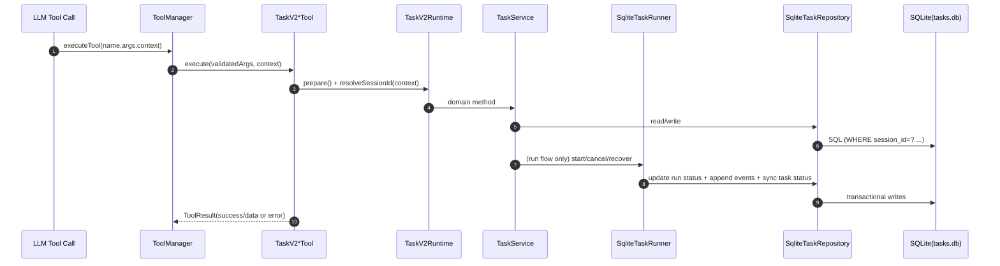
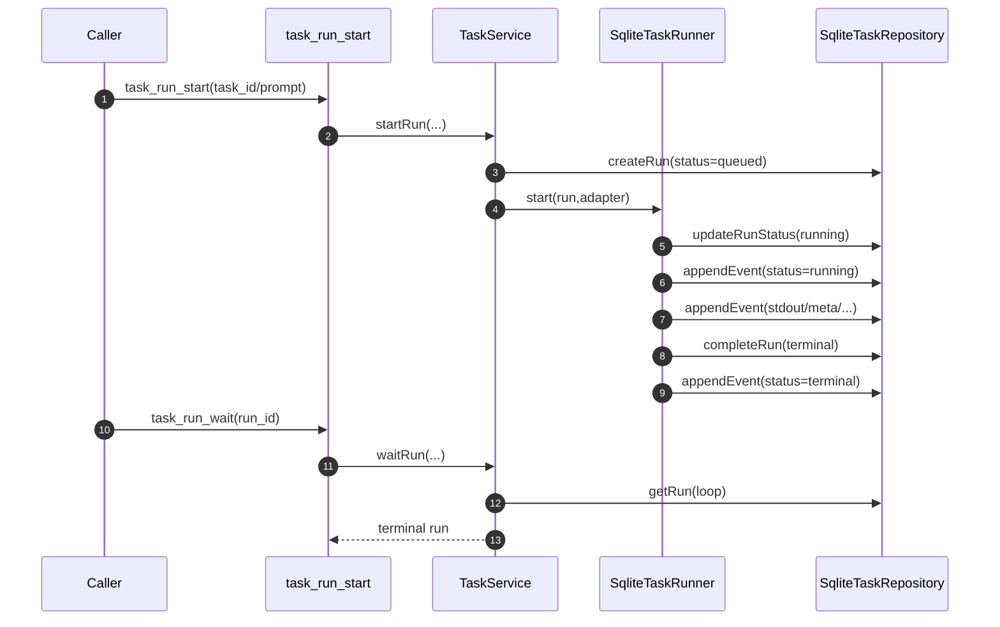

# Task 工具执行流程（Task V2）

本文档描述当前 `task_*` / `task_run_*` 工具在代码中的真实执行路径，覆盖：入口、状态流转、存储写入、恢复与取消、错误语义。

## 1. 范围与目标

- 范围：`src/tool/task-v2-tools.ts`、`src/tool/task-v2/**`
- 工具集合：
  - 任务域：`task_create` `task_get` `task_list` `task_update` `task_delete`
  - 依赖域：`task_dependency_add` `task_dependency_list` `task_dependency_remove`
  - 简化入口：`task_submit`
  - 调度域：`task_dispatch_ready`
  - 执行域：`task_run_start` `task_run_get` `task_run_wait` `task_run_cancel` `task_run_events`
  - 运维域：`task_clear_session` `task_gc_runs`
- 目标：
  - 单一任务模型（不再区分 managed/background 两套语义）
  - 全链路 `session_id` 隔离
  - SQLite/WAL + 事务一致性
  - 可恢复执行（runner 收敛 `queued/running/cancel_requested`）
  - 子智能体配置快照化（profile + overrides）

## 2. 总体调用链



## 3. 关键组件职责

### 3.1 `TaskV2*Tool`（API 层）

- 参数校验（zod）
- 解析 `session_id`
- 调用 service
- 统一输出格式（snake_case）
- 错误映射：`TaskV2Error -> {success:false,error:"CODE: msg",data:details}`

### 3.2 `TaskV2Runtime`（运行时装配）

- 默认 DB 路径：`$workspace/.agent-cli/tasks.db`
- 组装 `SqliteTaskRepository + SqliteTaskRunner + TaskService`
- `prepare()` 触发：建表 + runner 恢复
- session 解析优先级：
  1. `context.agentContext.sessionId`
  2. `context.agent.getSessionId()`
  3. `default-session`

### 3.3 `TaskService`（领域规则）

- 任务状态机校验（非法迁移拒绝）
- 依赖环检测
- run 启动前约束：`task_id` 或 `prompt` 至少一个
- `task_id` 存在且 `prompt` 缺失时，自动使用 `task.title + description`
- `waitRun` 轮询等待终态

### 3.4 `SqliteTaskRepository`（持久化）

- 表：
  - `task_v2_tasks`
  - `task_v2_dependencies`
  - `task_v2_runs`
  - `task_v2_run_events`
- 事务点：
  - `appendRunEvent`（seq 递增）
  - `gcRuns`
  - `clearSession`
  - `updateTask`（乐观锁版本推进）
- 安全约束：所有对外读取/更新都带 `session_id`

### 3.5 `SqliteTaskRunner`（执行与恢复）

- `recover()` 扫描状态：`queued/running/cancel_requested`
- 收敛策略：
  - `running -> failed(run interrupted by runner restart)`
  - `cancel_requested -> cancelled`
  - `queued` 但无 adapter -> `failed`
- `cancel()` 幂等：
  - 终态直接返回
  - 非终态置 `cancel_requested` 并写事件
  - 活跃执行时触发 `AbortController.abort()`

### 3.6 SubAgent Profile（子智能体配置）

- `task_run_start` 支持：
  - `agent_profile_id`
  - `agent_overrides`（`system_prompt/max_steps/tool_allowlist/...`）
- profile 与 overrides 合并后写入 run 快照：
  - `agent_profile_id`
  - `agent_config_snapshot`
- 执行阶段严格按快照构建子 Agent（避免配置漂移）

`agent_config_snapshot` 关键字段：
- `profileId/profileName/profileVersion`：配置来源标识
- `systemPrompt`：子智能体 system 提示词
- `outputContract`：输出结构约束
- `maxSteps`：子智能体最大步数
- `timeoutMs`：执行超时
- `toolAllowlist/toolDenylist`：工具白名单/黑名单
- `memoryMode`：`inherit | isolated | off`
- `metadata`：扩展字段（保留）

## 4. 工具逐个执行流程

## 4.1 `task_create`

1. zod 校验 `title/description/priority/status`
2. `runtime.prepare()`
3. 解析 `session_id`
4. `createTask(sessionId, input, createTaskId())`
5. `INSERT task_v2_tasks`（`version=1`）
6. 返回 task 结构

## 4.2 `task_get`

1. 校验 `task_id`
2. `SELECT ... FROM task_v2_tasks WHERE session_id=? AND id=?`
3. 不存在抛 `NOT_FOUND`

## 4.3 `task_list`

1. 校验 `status/priority/limit`
2. `SELECT ... WHERE session_id=? [AND status] [AND priority] ORDER BY updated_at DESC LIMIT ?`

## 4.4 `task_update`

1. 读当前 task
2. 校验状态迁移（`canTransitionTaskStatus`）
3. 乐观锁更新（`expected_version`）
4. 成功：`version + 1`
5. 失败：`CONFLICT`（并发写或版本不匹配）

## 4.5 `task_delete`

1. `DELETE task_v2_tasks WHERE session_id=? AND id=?`
2. 依赖与 run 通过 FK 自动清理/置空

## 4.6 `task_dependency_add` / `task_dependency_list` / `task_dependency_remove`

1. `task_dependency_add` 添加边：`task_id -> depends_on_task_id`
2. service 写入后做环检测，发现环则回滚并报错
3. `task_dependency_list` 支持按 session 或按 task 查询
4. `task_dependency_remove` 删除依赖边（幂等）

## 4.7 `task_dispatch_ready`（DAG 并发调度）

1. 扫描任务与依赖边
2. 将“依赖全部 `completed` 且当前 `pending/blocked`”任务提升为 `ready`
3. 过滤掉已有活跃 run（`queued/running/cancel_requested`）的任务
4. 按 `max_parallel` 并发启动 `ready` 任务 run
5. `wait=true` 时批量等待，`include_events=true` 时附带每个 run 的事件流

## 4.8 `task_submit`（LLM 推荐入口）

1. 最小必填入参：`prompt + profile + title + description`
2. 先创建 task（默认 `status=ready`）
3. 使用 `profile` 解析子智能体配置快照
4. 启动 run
5. `wait=true` 时内部自动 `waitRun`
6. `include_events=true` 时附带事件分页结果
7. 一次返回 `task + run + waited/timed_out (+ events)`

## 4.9 `task_run_start`

1. 校验：`task_id` 或 `prompt` 至少一项
2. 解析子智能体配置：
   - 选择 profile（`agent_profile_id` 或回退 `agent_type`）
   - 合并 `agent_overrides`
   - 生成 `agent_config_snapshot`
3. 解析 provider：
   - 优先 `tool option.provider`
   - 否则从父 agent config 获取
   - 缺失则返回 `TASK_PROVIDER_MISSING`
4. 构造 run adapter（`createAgentRunExecutionAdapter`）
5. `createRun(status=queued,input_snapshot=...)`
6. `runner.start(run, adapter)`
7. runner 异步推进：`queued -> running -> terminal`

## 4.10 `task_run_get`

- 按 `session_id + run_id` 读取 run 当前快照

## 4.11 `task_run_wait`

1. 轮询 `task_run_get`
2. 命中终态返回
3. 到 timeout 返回当前状态并带 `timed_out=true`

## 4.12 `task_run_cancel`

1. 非终态 run：置 `cancel_requested`
2. 追加 `status(cancel_requested)` 事件
3. 若活跃执行存在，触发 abort
4. runner 收敛到 `cancelled`

## 4.13 `task_run_events`

1. 校验 run 在本 session 可见
2. `SELECT ... WHERE session_id=? AND run_id=? AND seq>? ORDER BY seq ASC LIMIT ?`
3. 返回 `next_after_seq`

## 4.14 `task_clear_session`

- 当前 session 维度清理：tasks + runs（级联 events/dependencies）

## 4.15 `task_gc_runs`

- 删除指定时间点之前的终态 runs
- 不影响未终态 run

## 5. 状态机

### 5.1 Task 状态机

- `pending -> ready -> running -> completed|failed|cancelled`
- `blocked <-> ready`
- service 中禁止越级非法迁移

### 5.2 Run 状态机

- `queued -> running -> succeeded|failed|cancelled|timeout`
- `cancel_requested` 为中间态，由 runner 收敛到 `cancelled`

## 6. 事件流（RunEvent）

最小事件序列通常为：

1. `status: running`
2. 过程事件：`stdout/stderr/tool_use/tool_result/meta`（0~N 条）
3. `status: succeeded|failed|cancelled|timeout`

`seq` 由 repository 内事务自增，保证每个 `(session_id, run_id)` 严格递增。

## 7. 并发与一致性说明

- `task_create`：ULID 风格 ID，无 `max+1` 竞争
- `task_update`：乐观锁 `version`
- `appendRunEvent`：事务内计算 `max(seq)+1` 后插入
- 取消语义：状态机驱动，不依赖内存“真值”
- 重启恢复：runner 启动时主动收敛不一致状态
- 子智能体配置：run 启动时快照化，执行期间不受外部配置变更影响

## 8. 错误语义

`TaskV2Error.code` 常见值：

- `NOT_FOUND`
- `INVALID_ARGUMENT`
- `INVALID_STATUS_TRANSITION`
- `CONFLICT`

工具层返回：

```json
{
  "success": false,
  "error": "CODE: message",
  "data": { "details": "..." }
}
```

## 9. 一次完整 run 的时序示例



## 10. 代码定位

- 工具层：`src/tool/task-v2-tools.ts`
- 运行时装配：`src/tool/task-v2/runtime/runtime.ts`
- 领域规则：`src/tool/task-v2/service.ts`
- 执行器：`src/tool/task-v2/runtime/sqlite-runner.ts`
- 子 agent adapter：`src/tool/task-v2/runtime/agent-adapter.ts`
- 持久化：`src/tool/task-v2/storage/sqlite-repository.ts`
